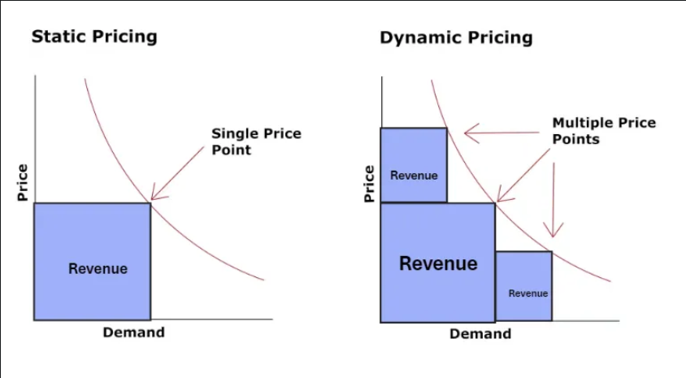
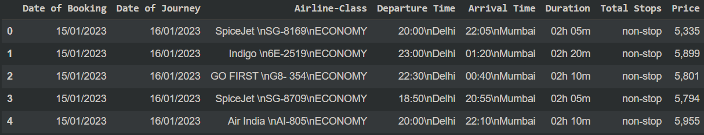
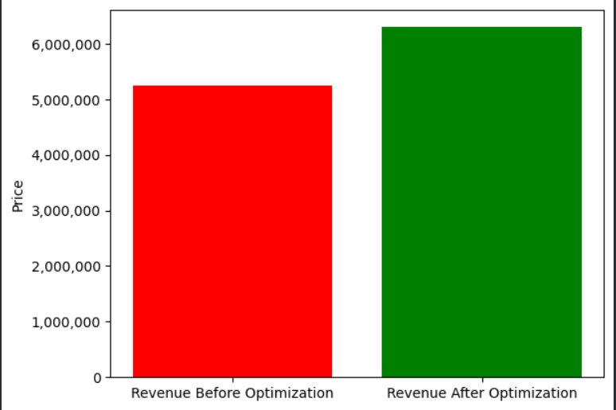
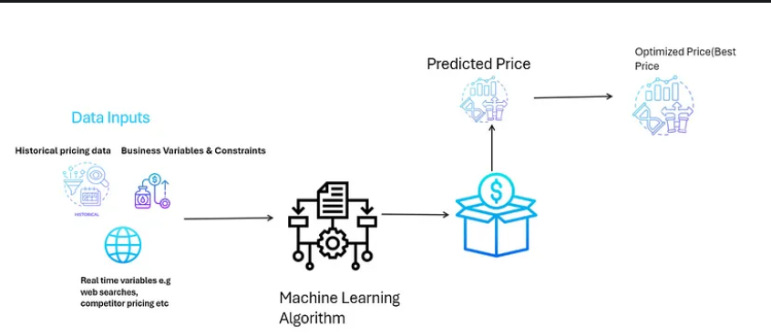
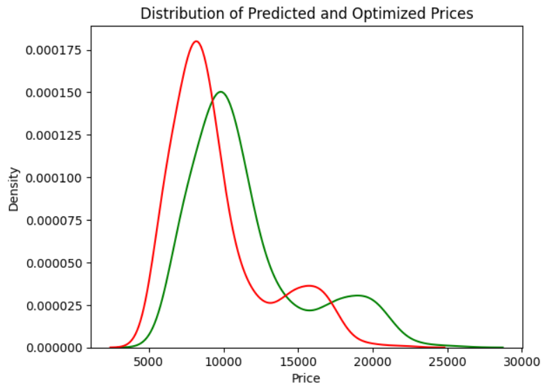

# Dynamic Price Optimization of Flight Tickets

## Introduction
This Project is about Price Optimization of Flight ticket booking prices. This dataset from Kaggle comprises details of flight bookings gathered using web scraping methods. It encompasses booking dates, journey dates, airline class, departure and arrival timings, flight duration, total stops, and prices.

## Business Goal
Assuming this is an airline whose current business problem is to maximize revenue with the sole purpose of increasing market share. The premise is that the airline’s current focus isn’t on generating profits. Instead, maximizing revenue entails boosting the total sales income, without immediate concern for the costs incurred in generating that revenue. This approach aligns well with our dataset, as it lacks details on operational expenses.

## Workflow
In terms of dynamic pricing for price optimization, we’ll have these two main steps

- Building the baseline model(Xgboost Regressor)to predict initial prices.

- Implementing a price optimization logic based on the business goal. To build a price optimization logic based on the predicted prices of each customer, we formulate an objective function that represents the business goals (e.g., maximizing revenue, profit) subject to certain constraints (e.g., pricing rules, number of seats left, ).

## Conclusion

Due to significant data limitations, our analysis did not incorporate additional factors such as seat availability, competitor pricing, and, in the case of profit maximization, operational costs.

Our primary objective was to maximize revenue regardless of operational expenses. By setting realistic lower and upper price bounds, we aim to strike a balance that benefits both customers and the business. The initial step of predicting prices is pivotal, as it allows us to leverage historical and real-time data insights.

In conclusion, the adoption of price optimization techniques is essential for businesses seeking to enhance profitability and revenue while navigating various constraints. By leveraging these methodologies, businesses can make informed, data-driven decisions and adapt flexibly to dynamic market conditions, fostering sustainable and realistic growth and profitability.

## Contributor

- Rudroneel Sengupta

## Contact Information

For inquiries or further information, please contact 11a.rudroneelsengupta@gmail.com

LinkedIn-www.linkedin.com/in/rudrasenupta